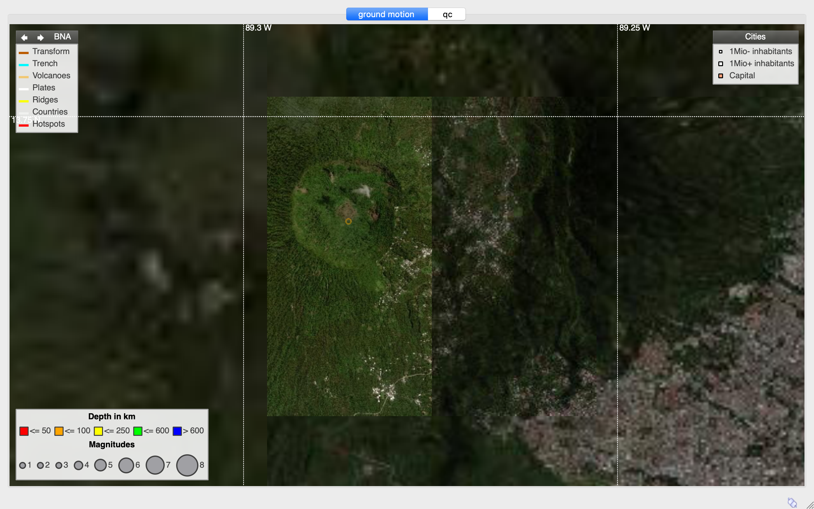

# SeisComP World Shaded Imagery and Geology




## What
Maps combining ESRI World Imagery and Hillshade map tiles with densified resolution on geologic features (only volcanoes for now).

- Country border from [University of Groningen](https://geo.rug.nl/arcgis/rest/services/Administratief_Wereld/World_countries).
- Tectonic plate borders, hotspots and volcanoes from [UG-UTexas](http://www-udc.ig.utexas.edu/external/plates/data.htm).
- Global active faults from [GEM](https://github.com/GEMScienceTools/gem-global-active-faults).
- Convertion to [BNA](https://gdal.org/drivers/vector/bna.html) were done with [QGIS](https://www.qgis.org).
- Map tiles download script with modified [downloadosmtiles.pl](https://metacpan.org/pod/release/ROTKRAUT/Geo-OSM-Tiles-0.02/downloadosmtiles.pl) to support mapserver tiles footprint.
- Composite map tile creation with [ImageMagick](https://imagemagick.org/index.php).

## How
Install [downloadosmtiles.pl](https://metacpan.org/pod/release/ROTKRAUT/Geo-OSM-Tiles-0.02/downloadosmtiles.pl) and [ImageMagick](https://imagemagick.org/index.php), adapt and run `makemap`. 
You can then move the `bna` and `map` directories to `~/.seiscomp*/` and add the following to `~/.seiscomp*/global.cfg`:
```bash
map.location = @CONFIGDIR@/map/%l/%r/%c.jpg
map.format = mercator
scheme.colors.map.cityLabels = ffffffff
```

## To do
- [ ] Densify on the [SeisComP scautoloc grid](https://github.com/FMassin/grid4scautoloc) area. 
- [ ] Broader densification around volcanoes ?
- [ ] Densify on other feature (e.g. 99 biggest cities) ?
- [ ] Add faults.
- [ ] Add geographice reference map tiles.
...
